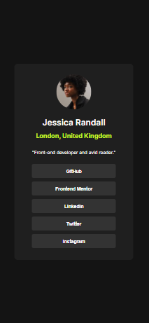
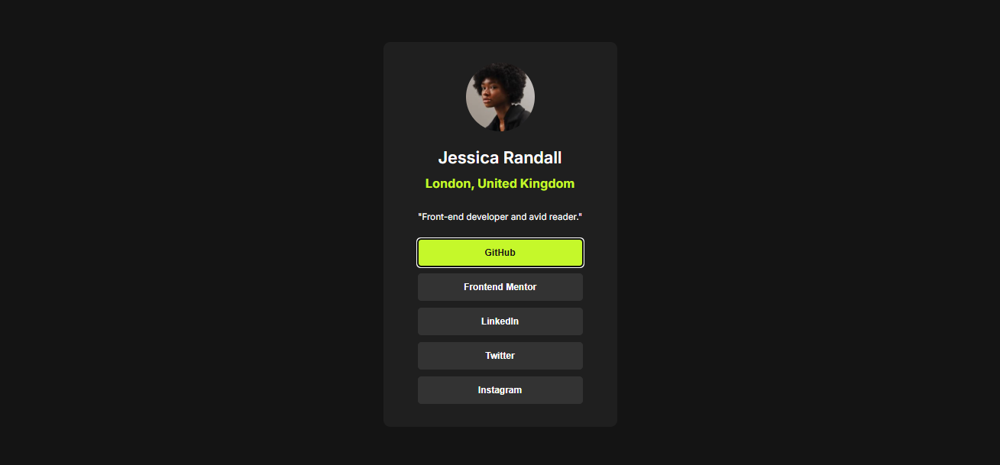

# Social Links Profile - Frontend Mentor

| Desktop                                              | Mobile                                              | Estados Interativos                                       |
| ---------------------------------------------------- | --------------------------------------------------- | --------------------------------------------------------- |
|  |  |  |

## 📋 O desafio

Os usuários devem ser capazes de:

- Ver estados de _hover_ e _focus_ em todos os elementos interativos da página
- Visualizar o perfil de forma responsiva em diferentes dispositivos

### 🔗 Links

- **Solução no Frontend Mentor:** [URL aqui]()
- **Site ao vivo:** [GitHub Pages aqui]()

## 🛠 Meu processo

### Construído com

- **HTML5 semântico** (tags `<main>`, `<button>`)
- **CSS com metodologia BEM** (`.card__button`)
- **Flexbox** para alinhamento centralizado
- **Variáveis CSS** (cores em HSL)
- **Transições CSS** para efeitos suaves

### O que aprendi

Neste projeto, pude praticar o HTML semântico (como usar `<button>` no lugar de `<div>` para elementos clicáveis) e a metodologia BEM para nomear classes CSS, o que tornou meu código mais legível e organizado.

Um dos maiores desafios foi aprender a criar e estilizar os estados de hover. Precisei pesquisar como aplicar:

- Efeitos suaves com transition: background-color 0.3s ease;

- Contraste acessível nas cores (como o verde hsl(75, 94%, 57%));

- Também descobri como esses efeitos se comportam em dispositivos móveis, onde o hover não existe, mas o feedback visual ainda é essencial.

E claro, o desafio mais universal de todos, centralizar a div.

#### Melhores práticas de acessibilidade

```html
<!-- Substitui divs por buttons para interações reais -->
<button class="card__button">GitHub</button>
```

### Desenvolvimento Futuro

Quero me aprofundar em:

Mobile-first workflow: Ainda não domino completamente a abordagem "começar pelo mobile" e pretendo estudar mais sobre media queries e unidades relativas (como rem).

Design responsivo avançado: Ajustar layouts para telas muito pequenas (ex.: 320px) e testar em dispositivos reais.
